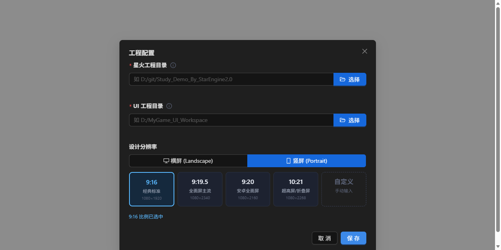
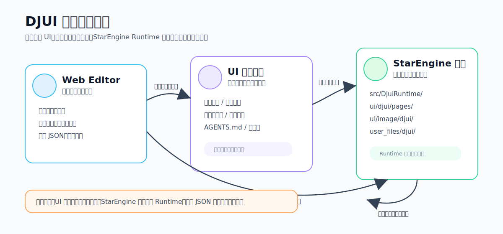
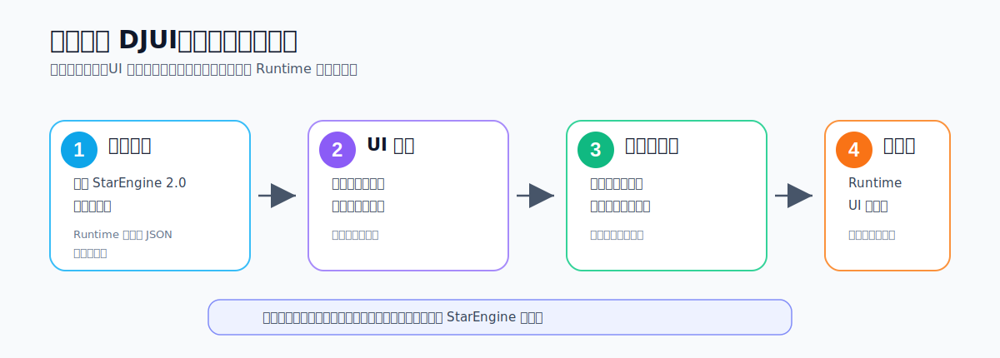
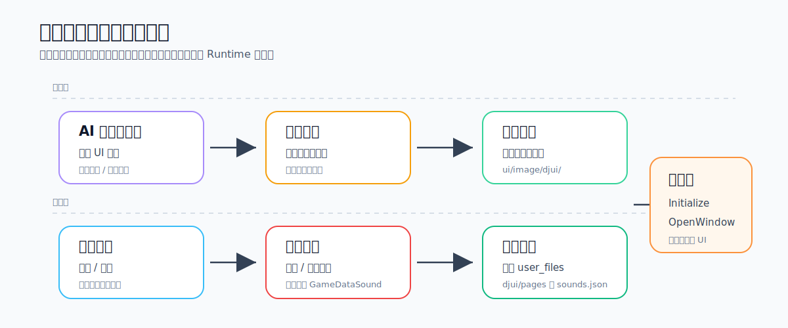

# DJUI

DJUI 是面向 **StarEngine 2.0** 的可视化 UI 编辑器。它把游戏 UI 的“编辑、素材准备、发布、运行时加载”拆成一套清晰流程：在网页里做页面和模板，在独立 UI 工程里管理素材，最后发布到星火工程，由 C# Runtime 在游戏中打开窗口。



## 在线使用

DJUI 已提供线上实例，开箱即用：

> **在线地址：<http://ui.duojie.games/>**

普通用户直接用线上版即可，**非必要无需自部署**。线上版和本地版功能一致，配置好星火工程路径和 UI 工程目录后即可开始工作。

下列情况才需要本地或自建部署：

- 网络不稳定、需要离线使用
- 想自行掌控数据与访问权限
- 需要二次开发或调试源码

自部署方式见下方 [本地启动](#本地启动) 和 [Docker 部署](#生产运行) 小节。

## 它是做什么的

DJUI 适合用来做静态页面、通用弹窗、背包格子、奖励列表、可复用模板等游戏 UI。它不是 StarEngine 本体，也不是单纯的图片管理器，而是连接下面三件事的工具：

- **Web Editor**：浏览器里的可视化 UI 编辑器，用来配置页面、模板、控件属性、动效和点击音效。
- **UI 工程目录**：独立工作区，用来放 AI 生图、原始素材、待审核素材、成品素材、素材处理脚本和工作规则。这个目录需要你自己纳入备份。
- **StarEngine 2.0 工程**：真正运行游戏的工程。DJUI 会把 Runtime、页面 JSON、音效配置和素材发布到这里，游戏运行时再通过 Runtime 打开窗口。



## 首次使用流程

第一次打开 DJUI 时，只要完成三个核心选择，就可以创建好工程：



1. **选择星火 2.0 项目工程**
   选择 StarEngine 2.0 项目的根目录。DJUI 会在这里安装或升级 `src/DjuiRuntime/`，并保存页面 JSON 到 `ui/djui/pages/`。

2. **选择 UI 工程目录**
   选择一个独立目录作为 UI 工作区。这个目录会保存原始素材、成品素材、待审核素材、脚本区、`AGENTS.md` 等内容。它不是临时缓存，请像对待项目资源一样保存和备份。

3. **选择横屏或竖屏分辨率**
   根据游戏基准分辨率选择横屏或竖屏。DJUI 会按这个尺寸创建画布，后续新建窗口默认使用这套设计分辨率。

保存配置后，在配置窗口里初始化 Runtime 和 UI 工作区。之后就可以进入正常编辑流程。

更完整的逐步教程见 [快速开始](docs/quickstart.md)。

## 创建好工程后做什么

主要工作分成两条线：配置 UI，以及准备素材。



### 1. 配置页面和模板

在 DJUI 左侧新建页面：

- **窗口**：运行时可以通过 `DjuiWindowManager.OpenWindow("页面ID")` 打开。
- **模板**：可复用 UI 片段，例如奖励格子、物品卡、通用列表项。

编辑完成后保存页面。页面源文件会写入星火工程的 `ui/djui/pages/`，发布时再复制到运行时读取的 `user_files/djui/pages/`。

### 2. 准备素材

素材建议都在 UI 工程里处理：

```text
UI 工程/
├── 原始素材/          # AI 生图、参考图、设计稿
├── 临时文件/          # 去绿幕、裁剪、压缩后的中间产物
├── 临时文件/待审核/   # 准备人工确认的候选成品
├── 成品素材/          # 只有这里会发布到游戏工程
├── 脚本区/            # DJUI 提供的素材处理脚本
└── AGENTS.md          # 给 AI 协作使用的素材规范
```

AI 生图、切图和素材加工都先放在 UI 工程里做。最终确认可用的图片放进 `成品素材/`，再在 DJUI 中引用。发布时，`成品素材/` 会复制到星火工程的 `ui/image/djui/`。

详细素材规则见 [素材与 AI 工作流](docs/workflow.md)。UI 工程中的 `AGENTS.md` 也会写清楚默认分类和命名规则，按这个规则走即可。

### 3. 发布并在游戏中调用

点击 DJUI 顶部菜单的发布功能后，会同步：

- `成品素材/` 到星火工程的 `ui/image/djui/`
- 页面 JSON 到 `user_files/djui/pages/`
- 声音配置到 `user_files/djui/sounds.json`

游戏启动时初始化 Runtime：

```csharp
using DjuiRuntime;

DjuiWindowManager.Initialize();
```

打开窗口：

```csharp
DjuiWindowManager.OpenWindow("main_menu");
```

Runtime 接入细节见 [Runtime 接入](docs/runtime.md)。

## 功能概览

- 可视化编辑窗口和模板页面。
- 支持图片、文本、按钮、进度条、模板实例等常用控件。
- 支持锚点、拉伸、自动布局、九宫格、透明度、遮罩、层级等 UI 属性。
- 支持窗口转场、控件动效预设、按钮默认点击音效。
- 支持引用 StarEngine 数编里的 `GameDataSound`，不重复管理音频资源。
- 支持 AI 素材工作区规则、待审核素材流转和素材处理脚本。
- Runtime 支持窗口管理、模板实例、动作路由、数据绑定、音频后端接管。

## 本地启动

环境要求：

- Node.js 20+
- npm 10+
- StarEngine 2.0 工程
- 可选：Python 3.10+ 和 Pillow，用于运行素材处理脚本

安装依赖：

```powershell
cd editor/backend
npm ci

cd ../frontend
npm ci
```

启动开发环境，分别打开两个终端：

```powershell
cd editor/backend
npm run dev
```

```powershell
cd editor/frontend
npm run dev
```

浏览器打开：

```text
http://localhost:7321
```

根目录也提供了聚合命令：

```powershell
npm run typecheck
npm run build
npm run dev:backend
npm run dev:frontend
```

## 文档入口

| 想了解 | 文档 |
|---|---|
| 从零接入一个 StarEngine 工程 | [快速开始](docs/quickstart.md) |
| AI 生图、素材目录、成品素材规则 | [素材与 AI 工作流](docs/workflow.md) |
| 游戏代码里如何初始化和打开窗口 | [Runtime 接入](docs/runtime.md) |
| 本地服务、CORS、路径访问安全 | [安全说明](docs/security.md) |
| 正式发布前检查哪些项目 | [发布检查清单](docs/release-checklist.md) |
| 如何参与维护 | [贡献指南](CONTRIBUTING.md) |

## 常见问题

**首次打开应该填什么？**
填 StarEngine 2.0 工程根目录、独立 UI 工程目录，再按项目选择横屏或竖屏分辨率。UI 工程目录请自行备份。

**UI 工程和星火工程分别保存什么？**
UI 工程主要保存素材、素材规则、脚本和素材元数据；星火工程保存 Runtime、页面 JSON、音效配置和发布后的运行文件。

**素材为什么没有进游戏？**
只有 `UI 工程/成品素材/` 会发布。原始素材、临时文件、待审核素材不会进入游戏工程。

**点击按钮没有声音？**
先在 StarEngine 数编里创建 `GameDataSound`，再在 DJUI 的声音配置里引用它，并设置按钮默认音效。控件右侧的“反馈效果 / 点击音效”可以改成其它可用音效。

**Runtime 提示需要升级怎么办？**
在工程配置窗口点击 Runtime 升级。项目侧的 `src/DjuiRuntime/` 由 DJUI 管理，不建议手动修改。

**页面打不开或找不到控件？**
确认页面已经保存并发布，`pageId` 和代码里的 `OpenWindow("pageId")` 一致。更多排查见 [Runtime 接入](docs/runtime.md)。

## 生产运行

```powershell
cd editor/frontend
npm run build

cd ../backend
npm run build
$env:NODE_ENV="production"
npm start
```

生产模式下后端会 serve `editor/frontend/dist`。

Docker 构建从仓库根目录执行：

```powershell
docker build -f editor/Dockerfile -t djui-editor .
docker run --rm -p 37241:37241 djui-editor
```

也可以直接拉取每次提交 main 后自动构建发布的镜像（GHCR）：

```powershell
docker pull ghcr.io/qq33357486/djui:latest
docker run --rm -p 37241:37241 ghcr.io/qq33357486/djui:latest
```

镜像标签：`latest` 始终指向 main 最新构建；另带 7 位 commit SHA 标签用于回溯历史版本。

## 安全默认值

DJUI 是本地开发工具，默认只监听 `127.0.0.1`，CORS 只允许本机来源。不要把后端暴露到不可信网络。需要远程访问时，显式设置：

```powershell
$env:DJUI_HOST="0.0.0.0"
$env:DJUI_CORS_ORIGIN="http://你的前端域名"
```

更多说明见 [安全说明](docs/security.md)。

## 开源许可

本项目使用 [MIT License](LICENSE)。
